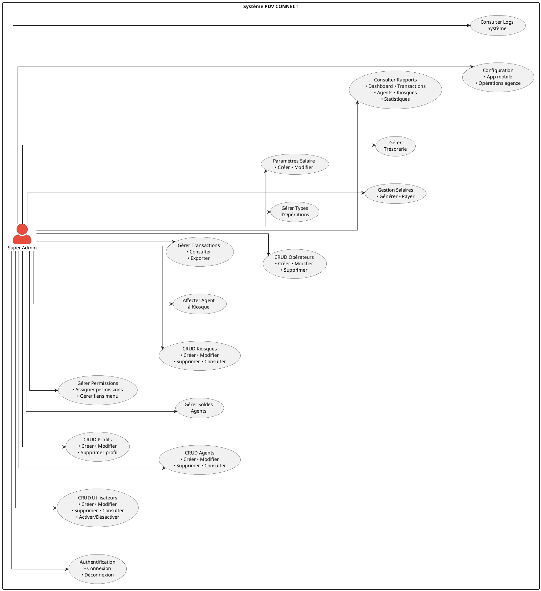
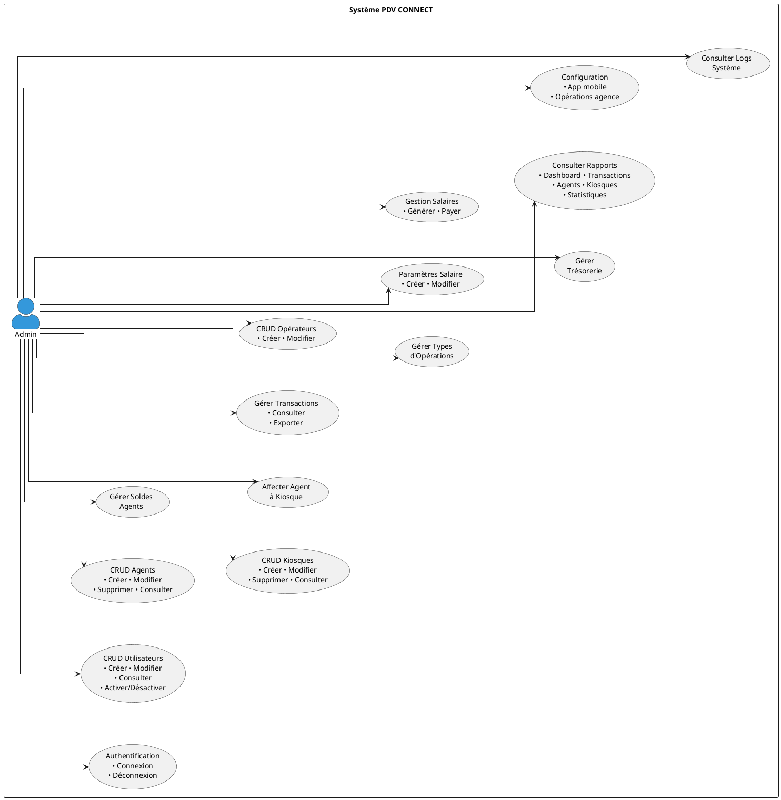
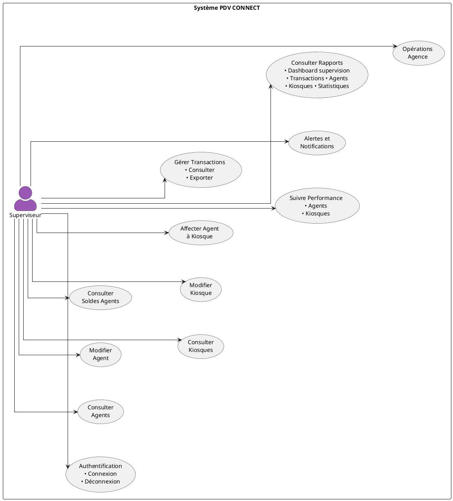
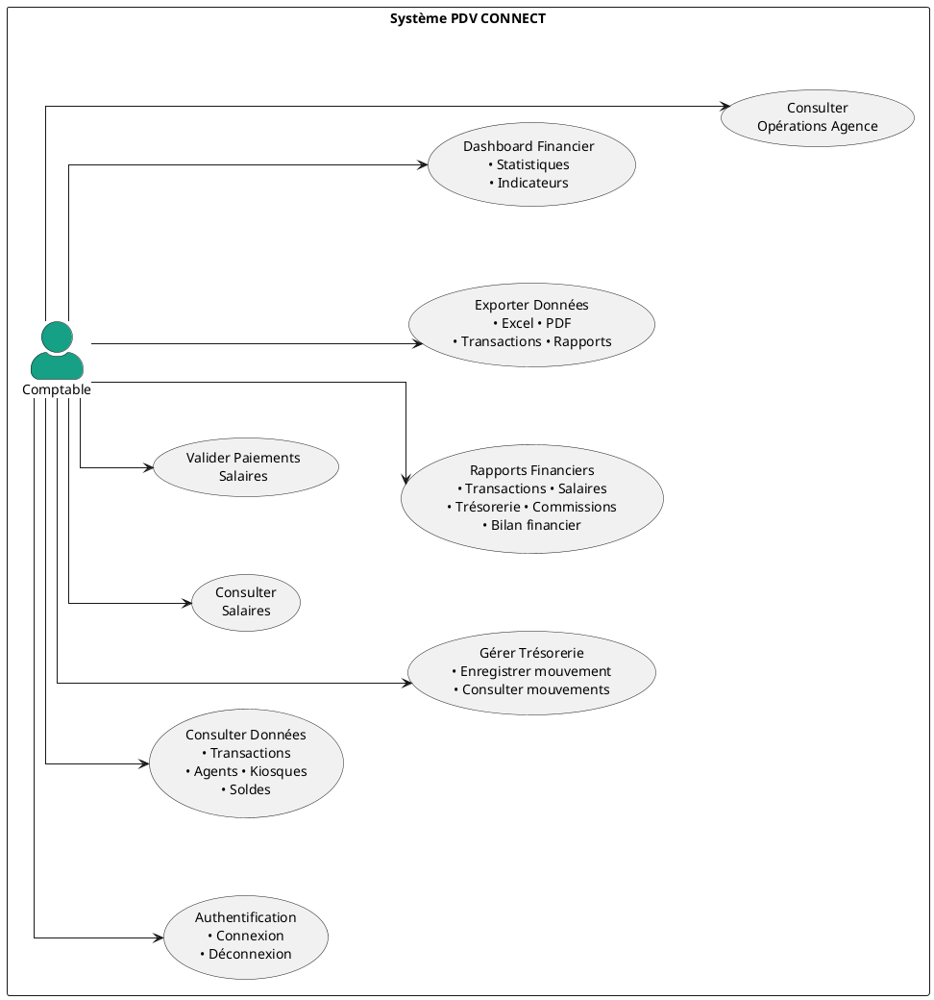
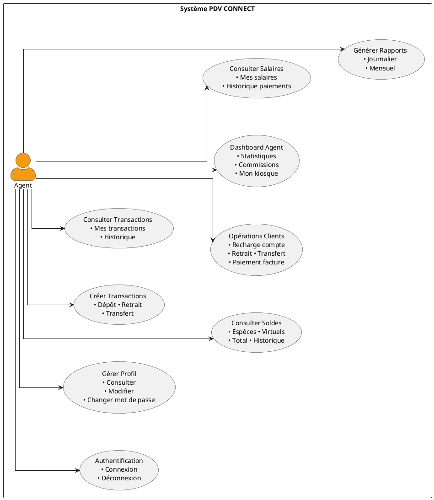
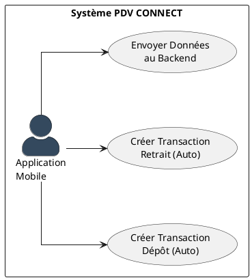

# Diagrammes de Cas d'Utilisation - PDV CONNECT

## Vue d'ensemble

Ce document présente les diagrammes de cas d'utilisation pour chaque acteur du système PDV CONNECT.

## Acteurs du système

### Acteurs humains
1. **Super Admin** - Accès complet au système
2. **Admin** - Administrateur de l'application
3. **Superviseur** - Supervision des agents et kiosques
4. **Comptable** - Gestion comptable et rapports
5. **Agent** - Agent de terrain

### Acteur système
6. **Application Mobile** - Système automatisé de création de transactions (acteur secondaire)

---

## 1. Diagramme de Cas d'Utilisation - Super Admin

---

## 2. Diagramme de Cas d'Utilisation - Admin

---

## 3. Diagramme de Cas d'Utilisation - Superviseur

---

## 4. Diagramme de Cas d'Utilisation - Comptable

---

## 5. Diagramme de Cas d'Utilisation - Agent

---

## 6. Diagramme de Cas d'Utilisation - Application Mobile (Service Automatisé)

### Caractéristiques de l'Application Mobile

**Type d'acteur:** Service automatisé (acteur secondaire)

**Rôle principal:** 
- Service dédié à la création automatique de transactions de **dépôt** et **retrait**
- Envoie les données de transaction au backend Laravel

**Fonctionnement:**
- Crée automatiquement les transactions lorsqu'un agent effectue un dépôt ou un retrait
- Transmet les informations au système backend via API
- Simplifie le processus de saisie pour les agents sur le terrain

---

## Matrice des Cas d'Utilisation par Acteur

| Cas d'Utilisation | Super Admin | Admin | Superviseur | Comptable | Agent | App Mobile |
|-------------------|:-----------:|:-----:|:-----------:|:---------:|:-----:|:----------:|
| **Gestion Utilisateurs** |
| Créer utilisateur | ✅ | ✅ | ❌ | ❌ | ❌ | ❌ |
| Modifier utilisateur | ✅ | ✅ | ❌ | ❌ | ❌ | ❌ |
| Supprimer utilisateur | ✅ | ❌ | ❌ | ❌ | ❌ | ❌ |
| Consulter utilisateurs | ✅ | ✅ | ❌ | ❌ | ❌ | ❌ |
| **Gestion Profils** |
| Créer profil | ✅ | ❌ | ❌ | ❌ | ❌ | ❌ |
| Modifier profil | ✅ | ❌ | ❌ | ❌ | ❌ | ❌ |
| Assigner permissions | ✅ | ❌ | ❌ | ❌ | ❌ | ❌ |
| **Gestion Agents** |
| Créer agent | ✅ | ✅ | ❌ | ❌ | ❌ | ❌ |
| Modifier agent | ✅ | ✅ | ✅ | ❌ | ❌ | ❌ |
| Supprimer agent | ✅ | ✅ | ❌ | ❌ | ❌ | ❌ |
| Consulter agents | ✅ | ✅ | ✅ | ✅ | ❌ | ❌ |
| **Gestion Kiosques** |
| Créer kiosque | ✅ | ✅ | ❌ | ❌ | ❌ | ❌ |
| Modifier kiosque | ✅ | ✅ | ✅ | ❌ | ❌ | ❌ |
| Supprimer kiosque | ✅ | ✅ | ❌ | ❌ | ❌ | ❌ |
| Consulter kiosques | ✅ | ✅ | ✅ | ✅ | ✅ | ❌ |
| **Gestion Transactions** |
| Créer transaction | ✅ | ✅ | ❌ | ❌ | ✅ | ❌ |
| Créer transaction dépôt (auto) | ❌ | ❌ | ❌ | ❌ | ❌ | ✅ |
| Créer transaction retrait (auto) | ❌ | ❌ | ❌ | ❌ | ❌ | ✅ |
| Envoyer données au backend | ❌ | ❌ | ❌ | ❌ | ❌ | ✅ |
| Consulter transactions | ✅ | ✅ | ✅ | ✅ | ✅ | ❌ |
| Exporter transactions | ✅ | ✅ | ✅ | ✅ | ❌ | ❌ |
| **Gestion Opérateurs** |
| Créer opérateur | ✅ | ✅ | ❌ | ❌ | ❌ | ❌ |
| Modifier opérateur | ✅ | ✅ | ❌ | ❌ | ❌ | ❌ |
| Supprimer opérateur | ✅ | ❌ | ❌ | ❌ | ❌ | ❌ |
| **Gestion Salaires** |
| Créer paramètre salaire | ✅ | ✅ | ❌ | ❌ | ❌ | ❌ |
| Générer salaires | ✅ | ✅ | ❌ | ❌ | ❌ | ❌ |
| Payer salaires | ✅ | ✅ | ❌ | ✅ | ❌ | ❌ |
| Consulter salaires | ✅ | ✅ | ❌ | ✅ | ✅ | ❌ |
| **Gestion Trésorerie** |
| Gérer trésorerie | ✅ | ✅ | ❌ | ✅ | ❌ | ❌ |
| Enregistrer mouvement | ✅ | ✅ | ❌ | ✅ | ❌ | ❌ |
| **Rapports** |
| Dashboard général | ✅ | ✅ | ✅ | ✅ | ❌ | ❌ |
| Dashboard agent | ❌ | ❌ | ❌ | ❌ | ✅ | ❌ |
| Rapports transactions | ✅ | ✅ | ✅ | ✅ | ✅ | ❌ |
| Rapports financiers | ✅ | ✅ | ❌ | ✅ | ❌ | ❌ |
| **Configuration** |
| Config app mobile | ✅ | ✅ | ❌ | ❌ | ❌ | ❌ |
| Logs système | ✅ | ✅ | ❌ | ❌ | ❌ | ❌ |
| Opérations agence | ✅ | ✅ | ✅ | ✅ | ❌ | ❌ |

---

## Légende

- ✅ : Accès complet
- ⚠️ : Accès limité (consultation uniquement ou actions restreintes)
- ❌ : Pas d'accès

---

## Relations entre Cas d'Utilisation

### Relations d'inclusion (<<include>>)

- **Créer transaction** <<include>> Vérifier solde agent
- **Créer transaction** <<include>> Mettre à jour solde
- **Générer salaires** <<include>> Calculer commissions
- **Payer salaires** <<include>> Créer mouvement trésorerie

### Relations d'extension (<<extend>>)

- **Créer agent** <<extend>> Créer kiosque (optionnel)
- **Consulter transactions** <<extend>> Exporter transactions
- **Consulter rapports** <<extend>> Exporter PDF/Excel

---

## Notes

### Acteurs humains
1. **Super Admin** a un accès complet à toutes les fonctionnalités du système
2. **Admin** a un accès similaire au Super Admin mais ne peut pas supprimer certaines entités critiques
3. **Superviseur** se concentre sur la supervision des agents et kiosques
4. **Comptable** gère les aspects financiers (salaires, trésorerie, rapports)
5. **Agent** a un accès limité aux fonctionnalités liées à ses opérations quotidiennes

### Acteur système
6. **Application Mobile** est un service automatisé (acteur secondaire) qui :
   - Crée automatiquement les transactions de **dépôt** et **retrait**
   - Envoie les données de transaction au backend Laravel
   - Simplifie le processus de saisie pour les agents sur le terrain

### Relations entre acteurs
- **Agent** utilise l'**Application Mobile** pour créer rapidement des transactions de dépôt et retrait
- L'**Application Mobile** envoie les données au backend géré par les **Admins**
- Les **Superviseurs** et **Comptables** consultent les transactions créées via l'**Application Mobile**
- La **Configuration App Mobile** est gérée par les **Super Admin** et **Admin**

---

**Version:** 1.1  
**Dernière mise à jour:** 26 mars 2026  
**Auteur:** Système PDV CONNECT
