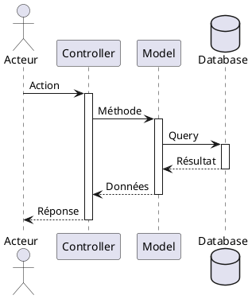
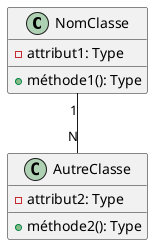

# Guide Complet de Réalisation des Diagrammes - PDV CONNECT

## 📋 Table des Matières

1. [Vue d'ensemble du système](#vue-densemble-du-système)
2. [Diagrammes de Cas d'Utilisation](#diagrammes-de-cas-dutilisation)
3. [Diagrammes de Séquence](#diagrammes-de-séquence)
4. [Diagramme de Classes](#diagramme-de-classes)
5. [Règles de Gestion](#règles-de-gestion)

---

## 🎯 Vue d'ensemble du système

### Description générale

**PDV CONNECT** est un système de gestion des points de vente Mobile Money permettant de :
- Gérer les agents et leurs transactions
- Superviser les kiosques et leurs performances
- Gérer les salaires et la trésorerie de l'entreprise
- Générer des rapports et statistiques
- Automatiser la création de transactions via une application mobile

### Architecture technique

- **Backend** : Laravel 12 (PHP 8.2+)
- **Frontend** : Blade + TailwindCSS + Alpine.js
- **Base de données** : MySQL
- **Navigation** : AJAX (Single Page Application)
- **API** : REST API avec authentification JWT pour l'application mobile

### Acteurs du système

1. **Super Admin** - Accès complet au système
2. **Admin** - Gestion opérationnelle (sauf profils et permissions)
3. **Superviseur** - Supervision des agents et kiosques
4. **Comptable** - Gestion financière et rapports
5. **Agent** - Opérations quotidiennes de transactions
6. **Application Mobile** - Service automatisé de création de transactions

---

## 📊 Diagrammes de Cas d'Utilisation

### 1. Super Admin

**Responsabilités** : Administration complète du système

**Cas d'utilisation** :

#### Authentification
- Se connecter au système
- Se déconnecter du système

#### Gestion des Utilisateurs
- Créer un utilisateur (nom, email, mot de passe, profils)
- Modifier un utilisateur
- Supprimer un utilisateur
- Consulter la liste des utilisateurs
- Activer/Désactiver un utilisateur

#### Gestion des Profils et Permissions
- Créer un profil (rôle)
- Modifier un profil
- Supprimer un profil
- Assigner des permissions à un profil
- Gérer les liens de menu accessibles par profil

#### Gestion des Agents
- Créer un agent (nom, téléphone, adresse, kiosque)
- Modifier les informations d'un agent
- Supprimer un agent
- Consulter la liste des agents
- Gérer les soldes des agents (espèces, virtuels par opérateur)

#### Gestion des Kiosques
- Créer un kiosque (nom, adresse, coordonnées GPS)
- Modifier un kiosque
- Supprimer un kiosque
- Consulter la liste des kiosques
- Affecter un agent à un kiosque

#### Gestion des Transactions
- Consulter toutes les transactions
- Exporter les transactions (Excel, PDF)


#### Gestion d'Entreprise
- Créer des paramètres de salaire (formules de calcul)
- Modifier des paramètres de salaire
- Générer les salaires mensuels
- Payer les salaires
- Gérer la trésorerie (mouvements d'entrée/sortie)

#### Rapports et Statistiques
- Consulter le dashboard général
- Générer des rapports de transactions
- Générer des rapports d'agents
- Générer des rapports de kiosques
- Consulter les statistiques globales

#### Configuration et Logs
- Configurer l'application mobile (URL API, filtres SMS)
- Consulter les logs système
- Gérer les opérations d'agence

---

### 2. Admin

**Responsabilités** : Gestion opérationnelle sans accès aux profils/permissions

**Cas d'utilisation** :

#### Authentification
- Se connecter au système
- Se déconnecter du système

#### Gestion des Utilisateurs (Limitée)
- Créer un utilisateur
- Modifier un utilisateur
- Consulter les utilisateurs
- Activer/Désactiver un utilisateur
- ❌ **Ne peut pas** supprimer d'utilisateurs

#### Gestion des Agents
- Toutes les opérations sur les agents (CRUD complet)
- Gérer les soldes des agents

#### Gestion des Kiosques
- Toutes les opérations sur les kiosques (CRUD complet)
- Affecter des agents aux kiosques

#### Gestion des Transactions
- Consulter les transactions
- Exporter les transactions

#### Gestion des Opérateurs
- Créer/Modifier des opérateurs
- Gérer les types d'opérations

#### Gestion d'Entreprise
- Créer/Modifier des paramètres de salaire
- Générer les salaires
- Payer les salaires
- Gérer la trésorerie

#### Rapports et Configuration
- Consulter tous les rapports
- Configurer l'application mobile
- Consulter les logs système
- Gérer les opérations d'agence

---

### 3. Superviseur

**Responsabilités** : Supervision des agents et kiosques

**Cas d'utilisation** :

#### Authentification
- Se connecter au système
- Se déconnecter du système

#### Consultation Agents
- Consulter la liste des agents
- Modifier les informations d'un agent
- Consulter les soldes des agents

#### Consultation Kiosques
- Consulter la liste des kiosques
- Modifier un kiosque
- Affecter un agent à un kiosque

#### Gestion des Transactions
- Consulter les transactions
- Exporter les transactions

#### Supervision
- Suivre la performance des agents
- Suivre la performance des kiosques
- Gérer les alertes et notifications

#### Rapports
- Consulter le dashboard de supervision
- Générer des rapports de transactions
- Générer des rapports d'agents
- Générer des rapports de kiosques
- Consulter les statistiques de zone

#### Opérations
- Gérer les opérations d'agence

---

### 4. Comptable

**Responsabilités** : Gestion financière et comptable

**Cas d'utilisation** :

#### Authentification
- Se connecter au système
- Se déconnecter du système

#### Consultation des Données
- Consulter les transactions
- Consulter les agents
- Consulter les kiosques
- Consulter les soldes

#### Gestion Financière
- Consulter les salaires
- Valider les paiements de salaires
- Gérer la trésorerie
- Enregistrer des mouvements de trésorerie
- Consulter les mouvements de trésorerie

#### Rapports Financiers
- Générer des rapports de transactions
- Générer des rapports de salaires
- Générer des rapports de trésorerie
- Générer des rapports de commissions
- Générer des bilans financiers

#### Export et Analyse
- Exporter les transactions (Excel, PDF)
- Exporter les rapports (Excel, PDF)
- Consulter le dashboard financier
- Consulter les statistiques financières
- Consulter les indicateurs de performance

#### Opérations
- Consulter les opérations d'agence

---

### 5. Agent

**Responsabilités** : Opérations quotidiennes de transactions

**Cas d'utilisation** :

#### Authentification
- Se connecter au système
- Se déconnecter du système

#### Gestion du Profil
- Consulter son profil
- Modifier son profil
- Changer son mot de passe

#### Gestion des Transactions
- Consulter ses transactions
- Consulter l'historique des transactions

#### Gestion des Soldes
- Consulter son solde espèces
- Consulter ses soldes virtuels (par opérateur)
- Consulter son solde total
- Consulter l'historique des soldes


#### Dashboard et Statistiques
- Consulter son dashboard personnel
- Consulter ses statistiques
- Consulter ses commissions
- Consulter les informations de son kiosque

#### Salaires
- Consulter ses salaires
- Consulter l'historique des paiements

#### Rapports
- Générer un rapport journalier
- Générer un rapport mensuel

---

### 6. Application Mobile (Service Automatisé)

**Responsabilités** : Création automatique de transactions

**Cas d'utilisation** :

#### Création Automatique de Transactions
- Créer automatiquement une transaction de dépôt
- Créer automatiquement une transaction de retrait
- Créer automatiquement une transaction d'annulation
- Envoyer les données au backend via API REST

**Note** : L'application mobile est un acteur secondaire qui interagit avec le système via une API REST sécurisée (JWT).

---

## 🔄 Diagrammes de Séquence

### 1. Authentification d'un utilisateur

**Acteurs** : Utilisateur (tous profils)

**Flux principal** :

1. L'utilisateur accède à la page de connexion
2. Le système affiche le formulaire de connexion
3. L'utilisateur saisit son email et mot de passe
4. L'utilisateur clique sur "Se connecter"
5. Le système valide les credentials
6. Le système vérifie que l'utilisateur est actif
7. Le système crée une session
8. Le système charge les permissions de l'utilisateur
9. Le système redirige vers le dashboard approprié

**Flux alternatif 1 - Credentials invalides** :
- 5a. Les credentials sont invalides
- 5b. Le système affiche un message d'erreur
- 5c. Retour à l'étape 3

**Flux alternatif 2 - Utilisateur inactif** :
- 6a. L'utilisateur est désactivé
- 6b. Le système affiche un message "Compte désactivé"
- 6c. Fin du processus

**Objets impliqués** :
- `AuthController`
- `Utilisateur` (Model)
- `Profil` (Model)
- `Lien` (Model - permissions)
- `Session`

---


### 3. Création automatique de transaction par l'application mobile

**Acteurs** : Application Mobile

**Flux principal** :

1. L'application mobile détecte un SMS de transaction
2. L'application mobile parse le SMS selon les filtres configurés
3. L'application mobile extrait les informations (type, montant, numéro, opérateur)
4. L'application mobile prépare les données JSON
5. L'application mobile envoie une requête POST à l'API `/api/transactions`
6. L'application mobile inclut le token JWT dans le header
7. Le backend valide le token JWT
8. Le backend valide les données reçues
9. Le backend identifie l'agent associé
10. Le backend crée la transaction
11. Le backend met à jour les soldes
12. Le backend enregistre un audit
13. Le backend retourne une réponse JSON (succès)
14. L'application mobile enregistre la réponse localement

**Flux alternatif 1 - Token invalide** :
- 7a. Le token JWT est invalide ou expiré
- 7b. Le backend retourne une erreur 401 Unauthorized
- 7c. L'application mobile tente de renouveler le token
- 7d. Retour à l'étape 5

**Flux alternatif 2 - Données invalides** :
- 8a. Les données sont invalides
- 8b. Le backend retourne une erreur 422 avec les détails
- 8c. L'application mobile enregistre l'erreur
- 8d. Fin du processus

**Flux alternatif 3 - Pas de connexion Internet** :
- 5a. L'application mobile détecte l'absence de connexion
- 5b. L'application mobile met la transaction en queue locale
- 5c. L'application mobile enregistre les données dans une base de données locale (SQLite)
- 5d. L'application mobile attend le retour de la connexion
- 5e. Lorsque la connexion est rétablie, l'application mobile traite la queue
- 5f. Pour chaque transaction en queue :
  - L'application mobile envoie la requête POST à l'API
  - Si succès : supprime l'entrée de la queue locale
  - Si échec : garde l'entrée en queue pour réessayer plus tard
- 5g. Retour à l'étape 5 du flux principal

**Objets impliqués** :
- `API TransactionController`
- `JWTMiddleware`
- `Transaction` (Model)
- `Agent` (Model)
- `Solde` (Model)
- `ConfigAppMobile` (Model)
- `Audit` (Model)
- `Queue` (Local SQLite - App Mobile)

---

### 4. Génération des salaires mensuels

**Acteurs** : Admin ou Super Admin

**Flux principal** :

1. L'admin accède à la page "Gestion Entreprise"
2. L'admin clique sur l'onglet "Salaires"
3. Le système affiche la liste des salaires existants
4. L'admin clique sur "Générer les salaires"
5. Le système affiche un formulaire de sélection de mois/année
6. L'admin sélectionne le mois et l'année
7. L'admin clique sur "Générer"
8. Le système récupère tous les paramètres de salaire actifs
9. Pour chaque paramètre de salaire :
   - 9a. Le système identifie les agents concernés (par profil)
   - 9b. Le système calcule les transactions du mois
   - 9c. Le système évalue la formule de calcul
   - 9d. Le système calcule le montant du salaire
   - 9e. Le système crée un enregistrement de salaire
10. Le système enregistre un audit
11. Le système affiche un message de succès avec le nombre de salaires générés
12. Le système rafraîchit la liste des salaires

**Flux alternatif 1 - Salaires déjà générés** :
- 8a. Des salaires existent déjà pour ce mois
- 8b. Le système affiche un message d'avertissement
- 8c. L'admin peut choisir de régénérer (écrase les anciens)
- 8d. Retour à l'étape 8

**Flux alternatif 2 - Aucun paramètre actif** :
- 8a. Aucun paramètre de salaire n'est actif
- 8b. Le système affiche "Aucun paramètre de salaire configuré"
- 8c. Fin du processus

**Objets impliqués** :
- `GestionEntrepriseController`
- `ParametreSalaire` (Model)
- `Salaire` (Model)
- `Agent` (Model)
- `Transaction` (Model)
- `Profil` (Model)
- `Audit` (Model)

---

### 5. Affectation d'un agent à un kiosque

**Acteurs** : Admin ou Super Admin

**Flux principal** :

1. L'admin accède à la page "Agents"
2. Le système affiche la liste des agents
3. L'admin sélectionne un agent
4. Le système affiche les détails de l'agent
5. L'admin clique sur "Affecter à un kiosque"
6. Le système affiche la liste des kiosques disponibles
7. L'admin sélectionne un kiosque
8. L'admin clique sur "Affecter"
9. Le système vérifie si l'agent est déjà affecté à un kiosque
10. Le système crée un historique de l'ancienne affectation (si existe)
11. Le système met à jour le kiosque de l'agent
12. Le système crée un nouvel enregistrement dans l'historique
13. Le système enregistre un audit
14. Le système affiche un message de succès
15. Le système rafraîchit les détails de l'agent

**Flux alternatif 1 - Désaffectation** :
- 5a. L'admin clique sur "Désaffecter du kiosque"
- 5b. Le système affiche une confirmation
- 5c. L'admin confirme
- 5d. Le système crée un historique avec date de fin
- 5e. Le système met à jour l'agent (kiosque_id = null)
- 5f. Le système enregistre un audit
- 5g. Fin du processus

**Objets impliqués** :
- `AgentController`
- `Agent` (Model)
- `Kiosque` (Model)
- `AgentKiosqueHistorique` (Model)
- `Audit` (Model)

---

## 🏗️ Diagramme de Classes

### Entités principales

#### 1. Utilisateur

**Attributs** :
- `id` : Integer (PK)
- `nom` : String
- `email` : String (unique)
- `password` : String (hashé)
- `actif` : Boolean
- `created_at` : Timestamp
- `updated_at` : Timestamp

**Relations** :
- Appartient à plusieurs `Profil` (N-N via `user_profils`)
- A plusieurs `Audit` (1-N)

**Méthodes** :
- `getProfils()` : Collection<Profil>
- `hasPermission(string $route)` : Boolean
- `isActive()` : Boolean
- `getPermissions()` : Collection<Lien>

---

#### 2. Profil

**Attributs** :
- `id` : Integer (PK)
- `libelle` : String
- `description` : Text
- `created_at` : Timestamp
- `updated_at` : Timestamp

**Relations** :
- Appartient à plusieurs `Utilisateur` (N-N via `user_profils`)
- A plusieurs `Lien` (N-N via `profil_liens`)
- A plusieurs `ParametreSalaire` (N-N via `parametre_salaire_profil`)

**Méthodes** :
- `getUtilisateurs()` : Collection<Utilisateur>
- `getLiens()` : Collection<Lien>
- `hasAccess(string $route)` : Boolean

---

#### 3. Lien (Permission)

**Attributs** :
- `id` : Integer (PK)
- `libelle` : String
- `route` : String
- `icon` : String
- `ordre` : Integer
- `parent_id` : Integer (FK nullable)
- `created_at` : Timestamp
- `updated_at` : Timestamp

**Relations** :
- Appartient à plusieurs `Profil` (N-N via `profil_liens`)
- A un `Lien` parent (auto-référence)
- A plusieurs `Lien` enfants (1-N)

**Méthodes** :
- `getParent()` : Lien|null
- `getChildren()` : Collection<Lien>
- `isParent()` : Boolean

---

#### 4. Agent

**Attributs** :
- `id` : Integer (PK)
- `nom` : String
- `prenom` : String
- `telephone` : String (unique)
- `adresse` : Text
- `kiosque_id` : Integer (FK nullable)
- `utilisateur_id` : Integer (FK nullable)
- `actif` : Boolean
- `created_at` : Timestamp
- `updated_at` : Timestamp

**Relations** :
- Appartient à un `Kiosque` (N-1)
- Appartient à un `Utilisateur` (1-1 optionnel)
- A plusieurs `Transaction` (1-N)
- A plusieurs `Solde` (1-N)
- A plusieurs `Salaire` (1-N)
- A plusieurs `AgentKiosqueHistorique` (1-N)

**Méthodes** :
- `getKiosque()` : Kiosque|null
- `getTransactions()` : Collection<Transaction>
- `getSoldes()` : Collection<Solde>
- `getSoldeEspeces()` : Float
- `getSoldeVirtuel(Operateur $operateur)` : Float
- `getSoldeTotal()` : Float
- `isActive()` : Boolean

---

#### 5. Kiosque

**Attributs** :
- `id` : Integer (PK)
- `nom` : String
- `adresse` : Text
- `latitude` : Decimal (nullable)
- `longitude` : Decimal (nullable)
- `telephone` : String
- `actif` : Boolean
- `created_at` : Timestamp
- `updated_at` : Timestamp

**Relations** :
- A plusieurs `Agent` (1-N)
- A plusieurs `AgentKiosqueHistorique` (1-N)

**Méthodes** :
- `getAgents()` : Collection<Agent>
- `getAgentActif()` : Agent|null
- `getTransactions()` : Collection<Transaction>
- `isActive()` : Boolean

---

#### 6. Transaction

**Attributs** :
- `id` : Integer (PK)
- `agent_id` : Integer (FK)
- `type_operation_id` : Integer (FK)
- `operateur_id` : Integer (FK nullable)
- `montant` : Decimal
- `numero_telephone` : String
- `reference` : String (unique)
- `date_transaction` : Timestamp
- `commentaire` : Text (nullable)
- `created_at` : Timestamp
- `updated_at` : Timestamp

**Relations** :
- Appartient à un `Agent` (N-1)
- Appartient à un `TypeOperation` (N-1)
- Appartient à un `Operateur` (N-1 optionnel)

**Méthodes** :
- `getAgent()` : Agent
- `getTypeOperation()` : TypeOperation
- `getOperateur()` : Operateur|null

---

#### 7. Solde

**Attributs** :
- `id` : Integer (PK)
- `agent_id` : Integer (FK)
- `operateur_id` : Integer (FK nullable)
- `type_solde` : Enum ('especes', 'virtuel')
- `montant` : Decimal
- `created_at` : Timestamp
- `updated_at` : Timestamp

**Relations** :
- Appartient à un `Agent` (N-1)
- Appartient à un `Operateur` (N-1 optionnel)

**Méthodes** :
- `getAgent()` : Agent
- `getOperateur()` : Operateur|null
- `crediter(float $montant)` : void
- `debiter(float $montant)` : void
- `isEspeces()` : Boolean
- `isVirtuel()` : Boolean

---

#### 8. Operateur

**Attributs** :
- `id` : Integer (PK)
- `nom` : String
- `logo` : String (nullable)
- `actif` : Boolean
- `created_at` : Timestamp
- `updated_at` : Timestamp

**Relations** :
- A plusieurs `TypeOperation` (1-N)
- A plusieurs `Transaction` (1-N)
- A plusieurs `Solde` (1-N)

**Méthodes** :
- `getTypesOperations()` : Collection<TypeOperation>
- `getTransactions()` : Collection<Transaction>
- `isActive()` : Boolean

---

#### 9. TypeOperation

**Attributs** :
- `id` : Integer (PK)
- `operateur_id` : Integer (FK)
- `libelle` : String
- `code` : String
- `sens` : Enum ('entree', 'sortie')
- `requiert_operateur` : Boolean
- `actif` : Boolean
- `created_at` : Timestamp
- `updated_at` : Timestamp

**Relations** :
- Appartient à un `Operateur` (N-1)
- A plusieurs `Transaction` (1-N)

**Méthodes** :
- `getOperateur()` : Operateur
- `getTransactions()` : Collection<Transaction>
- `isEntree()` : Boolean
- `isSortie()` : Boolean
- `isActive()` : Boolean

---

#### 10. ParametreSalaire

**Attributs** :
- `id` : Integer (PK)
- `libelle` : String
- `base_calcul` : Enum ('transactions', 'commissions', 'fixe')
- `formule` : Text
- `montant_fixe` : Decimal (nullable)
- `actif` : Boolean
- `created_at` : Timestamp
- `updated_at` : Timestamp

**Relations** :
- Appartient à plusieurs `Profil` (N-N via `parametre_salaire_profil`)
- A plusieurs `Salaire` (1-N)

**Méthodes** :
- `getProfils()` : Collection<Profil>
- `getSalaires()` : Collection<Salaire>
- `calculerMontant(Agent $agent, int $mois, int $annee)` : Float
- `isActive()` : Boolean

---

#### 11. Salaire

**Attributs** :
- `id` : Integer (PK)
- `agent_id` : Integer (FK)
- `parametre_salaire_id` : Integer (FK)
- `mois` : Integer
- `annee` : Integer
- `montant` : Decimal
- `statut` : Enum ('genere', 'paye')
- `date_paiement` : Date (nullable)
- `paye_par` : Integer (FK nullable)
- `created_at` : Timestamp
- `updated_at` : Timestamp

**Relations** :
- Appartient à un `Agent` (N-1)
- Appartient à un `ParametreSalaire` (N-1)
- Payé par un `Utilisateur` (N-1 optionnel)

**Méthodes** :
- `getAgent()` : Agent
- `getParametreSalaire()` : ParametreSalaire
- `getPayeur()` : Utilisateur|null
- `isPaye()` : Boolean
- `payer(Utilisateur $payeur)` : void

---

#### 12. MouvementTresorerie

**Attributs** :
- `id` : Integer (PK)
- `type` : Enum ('entree', 'sortie')
- `montant` : Decimal
- `libelle` : String
- `description` : Text (nullable)
- `date_mouvement` : Date
- `utilisateur_id` : Integer (FK)
- `created_at` : Timestamp
- `updated_at` : Timestamp

**Relations** :
- Créé par un `Utilisateur` (N-1)

**Méthodes** :
- `getUtilisateur()` : Utilisateur
- `isEntree()` : Boolean
- `isSortie()` : Boolean

---

#### 13. ConfigAppMobile

**Attributs** :
- `id` : Integer (PK)
- `code_config` : String (unique)
- `url_api` : String
- `token_api` : String
- `filtres_sms` : JSON
- `actif` : Boolean
- `created_at` : Timestamp
- `updated_at` : Timestamp

**Relations** :
- Aucune

**Méthodes** :
- `getFiltres()` : Array
- `isActive()` : Boolean

---

#### 14. SystemLog

**Attributs** :
- `id` : Integer (PK)
- `utilisateur_id` : Integer (FK nullable)
- `action` : String
- `table_name` : String
- `record_id` : Integer (nullable)
- `old_values` : JSON (nullable)
- `new_values` : JSON (nullable)
- `ip_address` : String
- `user_agent` : String
- `created_at` : Timestamp

**Relations** :
- Appartient à un `Utilisateur` (N-1 optionnel)

**Méthodes** :
- `getUtilisateur()` : Utilisateur|null
- `getOldValues()` : Array
- `getNewValues()` : Array

---

#### 15. Audit

**Attributs** :
- `id` : Integer (PK)
- `utilisateur_id` : Integer (FK)
- `action` : String
- `table_name` : String
- `record_id` : Integer
- `old_values` : JSON (nullable)
- `new_values` : JSON (nullable)
- `ip_address` : String
- `created_at` : Timestamp

**Relations** :
- Appartient à un `Utilisateur` (N-1)

**Méthodes** :
- `getUtilisateur()` : Utilisateur
- `getOldValues()` : Array
- `getNewValues()` : Array

---

#### 16. AgentKiosqueHistorique

**Attributs** :
- `id` : Integer (PK)
- `agent_id` : Integer (FK)
- `kiosque_id` : Integer (FK)
- `date_debut` : Date
- `date_fin` : Date (nullable)
- `created_at` : Timestamp
- `updated_at` : Timestamp

**Relations** :
- Appartient à un `Agent` (N-1)
- Appartient à un `Kiosque` (N-1)

**Méthodes** :
- `getAgent()` : Agent
- `getKiosque()` : Kiosque
- `isActif()` : Boolean

---

## 📐 Règles de Gestion

### Authentification et Sécurité

1. **RG-AUTH-01** : Tous les utilisateurs doivent s'authentifier pour accéder au système
2. **RG-AUTH-02** : Les mots de passe doivent être hashés avec bcrypt
3. **RG-AUTH-03** : Un utilisateur inactif ne peut pas se connecter
4. **RG-AUTH-04** : Les sessions expirent après 2 heures d'inactivité
5. **RG-AUTH-05** : L'API mobile utilise JWT pour l'authentification

### Gestion des Utilisateurs

6. **RG-USER-01** : Un email ne peut être utilisé que par un seul utilisateur
7. **RG-USER-02** : Un utilisateur peut avoir plusieurs profils
8. **RG-USER-03** : Seul le Super Admin peut supprimer des utilisateurs
9. **RG-USER-04** : Les permissions d'un utilisateur sont l'union des permissions de ses profils

### Gestion des Agents

10. **RG-AGENT-01** : Un agent ne peut être affecté qu'à un seul kiosque à la fois
11. **RG-AGENT-02** : Un numéro de téléphone ne peut être utilisé que par un seul agent
12. **RG-AGENT-03** : Un agent peut avoir plusieurs soldes (espèces + virtuels par opérateur)
13. **RG-AGENT-04** : L'historique des affectations kiosque doit être conservé
14. **RG-AGENT-05** : Un agent peut être lié à un utilisateur pour accéder au système

### Gestion des Transactions

15. **RG-TRANS-01** : Chaque transaction doit avoir une référence unique
16. **RG-TRANS-02** : Une transaction de sortie nécessite un solde suffisant
17. **RG-TRANS-03** : Les transactions sont enregistrées de manière définitive (pas de validation/annulation)

### Gestion des Soldes

21. **RG-SOLDE-01** : Un agent a un solde espèces unique
22. **RG-SOLDE-02** : Un agent a un solde virtuel par opérateur
23. **RG-SOLDE-03** : Les soldes ne peuvent pas être négatifs
24. **RG-SOLDE-04** : Les soldes sont mis à jour automatiquement lors des transactions
25. **RG-SOLDE-05** : L'historique des mouvements de solde doit être tracé

### Gestion des Opérateurs et Types d'Opérations

26. **RG-OPER-01** : Un type d'opération appartient à un opérateur
27. **RG-OPER-02** : Un type d'opération peut être "entree" ou "sortie"
28. **RG-OPER-03** : Certains types d'opérations ne requièrent pas d'opérateur (ex: paiement facture)
29. **RG-OPER-04** : Seuls les types d'opérations actifs sont disponibles

### Gestion des Salaires

30. **RG-SAL-01** : Les salaires sont générés mensuellement
31. **RG-SAL-02** : Un paramètre de salaire peut être basé sur : transactions, commissions, ou fixe
32. **RG-SAL-03** : Un paramètre de salaire peut s'appliquer à plusieurs profils
33. **RG-SAL-04** : La formule de calcul peut utiliser des variables : {nb_transactions}, {montant_total}, {commissions}
34. **RG-SAL-05** : Un salaire payé ne peut plus être modifié
35. **RG-SAL-06** : Seuls Admin, Super Admin et Comptable peuvent payer des salaires

### Gestion de la Trésorerie

36. **RG-TRES-01** : Tous les mouvements de trésorerie doivent être tracés
37. **RG-TRES-02** : Un mouvement peut être "entree" ou "sortie"
38. **RG-TRES-03** : Chaque mouvement doit avoir un libellé descriptif
39. **RG-TRES-04** : Seuls Admin, Super Admin et Comptable peuvent gérer la trésorerie

### Gestion des Permissions

40. **RG-PERM-01** : Seul le Super Admin peut gérer les profils et permissions
41. **RG-PERM-02** : Les liens de menu sont organisés en hiérarchie (parent/enfant)
42. **RG-PERM-03** : Un profil sans permissions ne peut accéder à aucune page
43. **RG-PERM-04** : Les permissions sont vérifiées à chaque requête

### Audit et Logs

44. **RG-AUDIT-01** : Toutes les actions CRUD doivent être auditées
45. **RG-AUDIT-02** : Les audits doivent enregistrer les anciennes et nouvelles valeurs
46. **RG-AUDIT-03** : Les audits doivent enregistrer l'utilisateur, l'IP et le user-agent
47. **RG-AUDIT-04** : Les logs système sont accessibles uniquement aux administrateurs
48. **RG-AUDIT-05** : Les logs doivent être conservés pendant au moins 1 an

### Application Mobile

49. **RG-MOBILE-01** : L'application mobile communique uniquement via API REST
50. **RG-MOBILE-02** : Les filtres SMS sont configurables dans le backend
51. **RG-MOBILE-03** : L'application mobile doit gérer les erreurs de connexion
52. **RG-MOBILE-04** : Les transactions créées par l'app mobile sont automatiquement validées

### Rapports et Statistiques

53. **RG-RAPPORT-01** : Les rapports peuvent être exportés en Excel ou PDF
54. **RG-RAPPORT-02** : Les rapports doivent être filtrables par date, agent, kiosque, opérateur
55. **RG-RAPPORT-03** : Le dashboard affiche les statistiques en temps réel
56. **RG-RAPPORT-04** : Chaque profil a accès à un dashboard adapté à ses besoins

---

## 🎨 Instructions de Réalisation des Diagrammes

### Diagrammes de Cas d'Utilisation

**Format recommandé** : PlantUML

**Structure** :
```plantuml
@startuml
left to right direction
skinparam actorStyle awesome
skinparam linetype ortho

rectangle "Système PDV CONNECT" {
  actor "Nom Acteur" as Acteur #couleur
  
  usecase "Cas d'utilisation 1" as UC1
  usecase "Cas d'utilisation 2" as UC2
  
  Acteur --> UC1
  Acteur --> UC2
}
@enduml
```

**Couleurs par acteur** :
- Super Admin : #e74c3c (rouge)
- Admin : #3498db (bleu)
- Superviseur : #9b59b6 (violet)
- Comptable : #16a085 (vert)
- Agent : #f39c12 (orange)
- App Mobile : #34495e (gris foncé)

### Diagrammes de Séquence

**Format recommandé** : PlantUML

**Structure** :


### Diagramme de Classes

**Format recommandé** : PlantUML

**Structure** :


**Conventions** :
- `-` : attribut/méthode privé
- `+` : attribut/méthode public
- `#` : attribut/méthode protégé
- `1..N` : cardinalité de la relation

---

## 📚 Ressources Complémentaires

### Technologies utilisées

Consultez le fichier `TECHNOLOGIES_UTILISEES.md` pour la liste complète des technologies.

### Structure de la base de données

Consultez le fichier `desc_schema` pour le schéma complet de la base de données.

### Cas d'utilisation détaillés

Consultez le fichier `DIAGRAMMES_CAS_UTILISATION.md` pour les diagrammes PlantUML complets.

---

**Version** : 1.0  
**Date** : 30 mars 2026  
**Auteur** : Système PDV CONNECT
