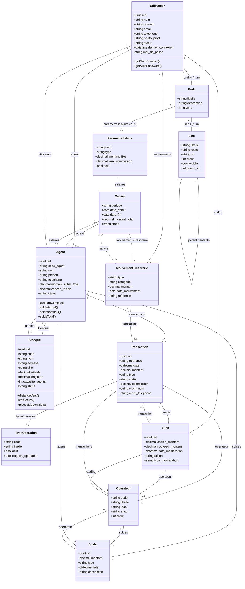
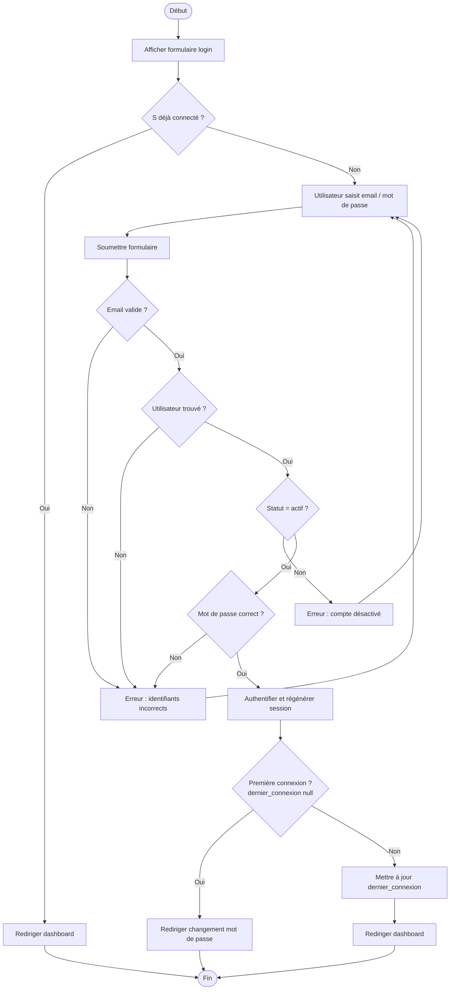
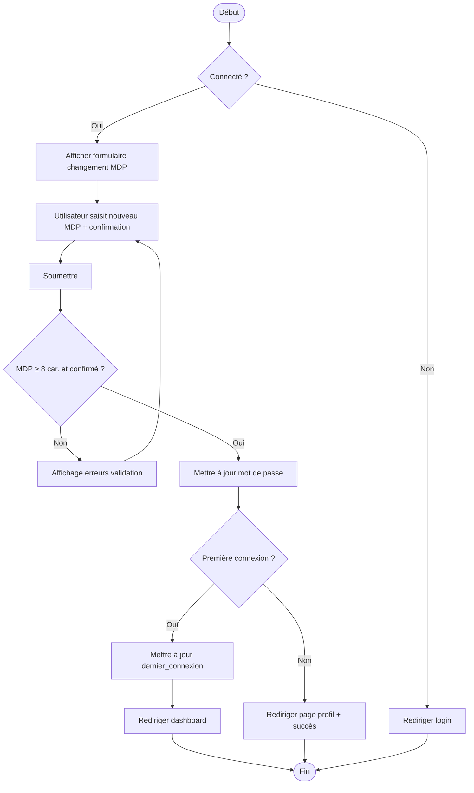
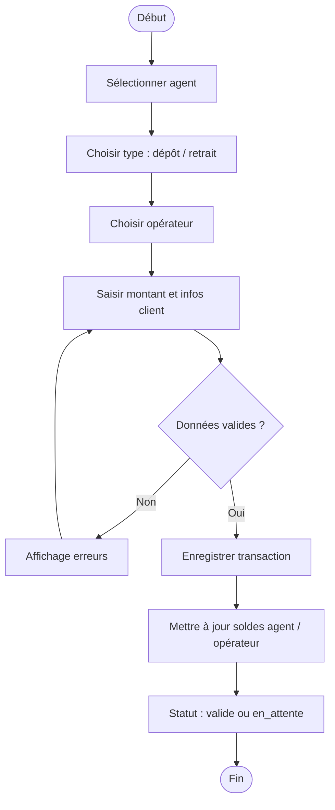
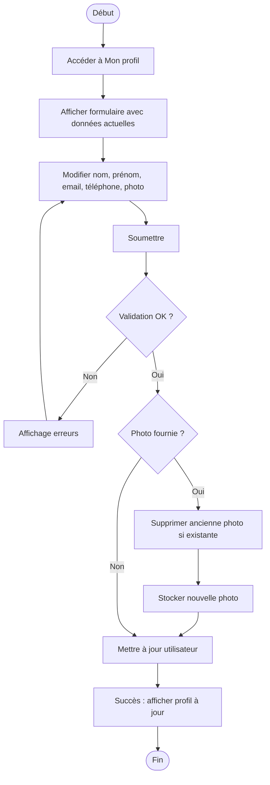
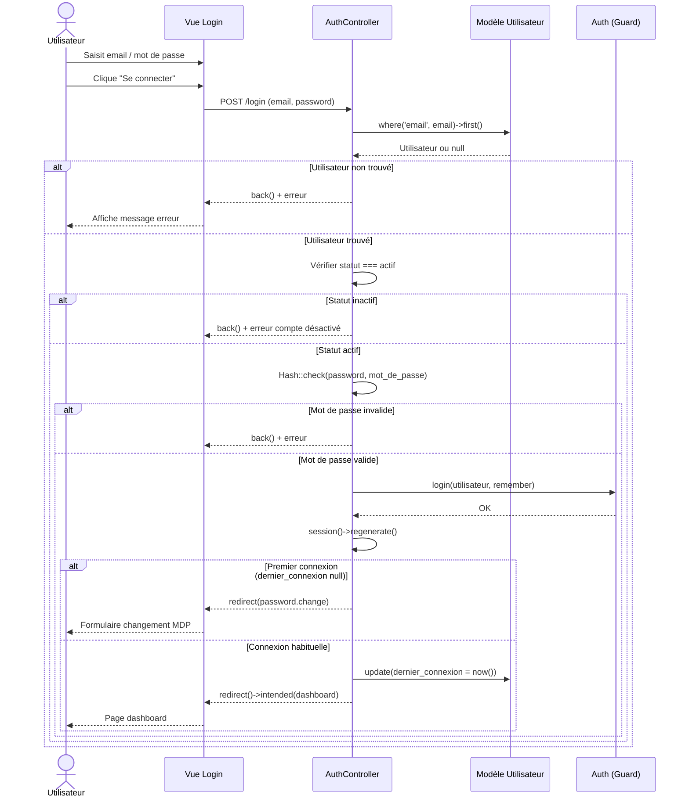
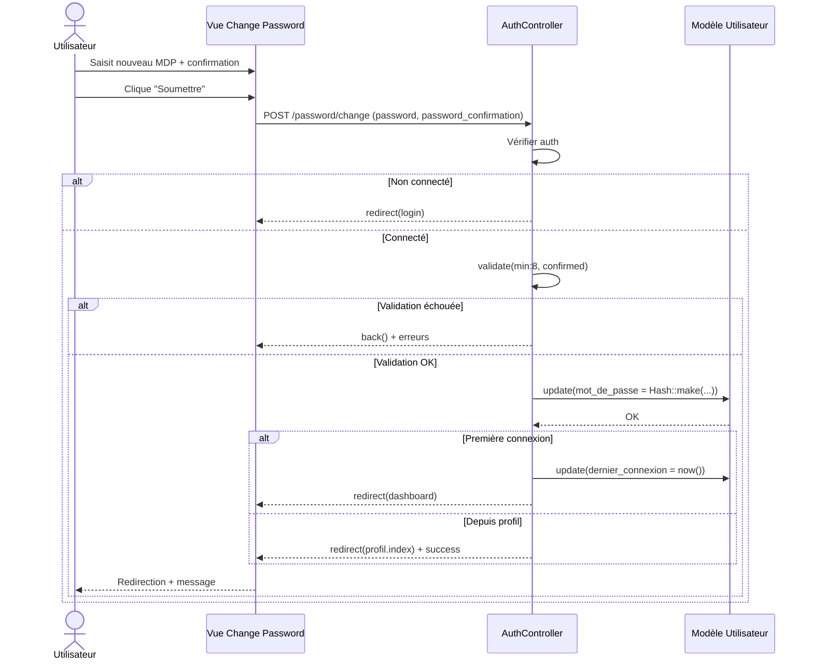
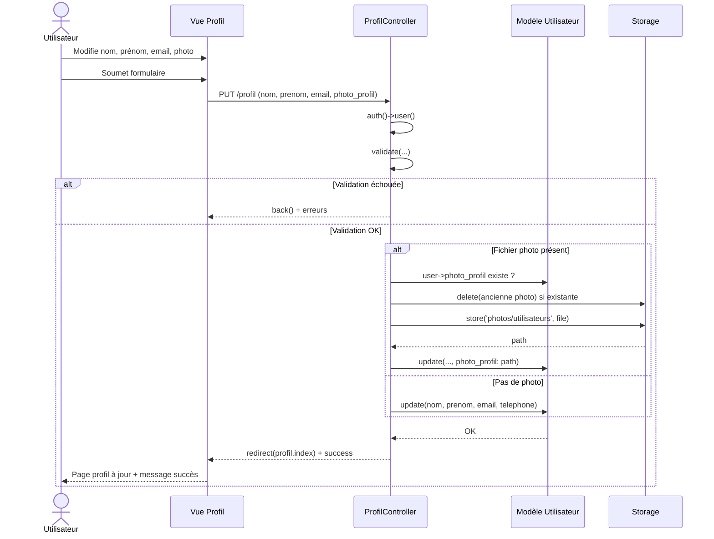
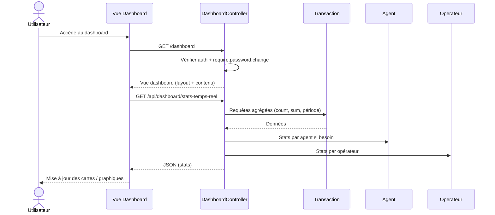

# Diagrammes UML — PDV.Connect

Documentation des diagrammes du projet (diagrammes de classe, cas d'utilisation, activités et séquences).  
Rendu possible avec [Mermaid Live](https://mermaid.live), GitHub, GitLab ou tout éditeur supportant Mermaid.

---

## 1. Diagramme de classes

Modèle de domaine principal : utilisateurs, profils, agents, kiosques, transactions, opérateurs, soldes, salaires et trésorerie.

---

## 2. Diagramme de cas d'utilisation

Acteurs et cas d'usage principaux du portail PDV.Connect.

```mermaid
flowchart TB
    subgraph Acteurs
        Admin((Administrateur))
        User((Utilisateur connecté))
        Agent((Agent PDV))
    end

    subgraph Authentification
        UC1[Se connecter]
        UC2[Changer mot de passe]
        UC3[Se déconnecter]
    end

    subgraph Profil
        UC4[Consulter mon profil]
        UC5[Modifier mon profil]
    end

    subgraph Gestion_utilisateurs
        UC6[Créer / modifier utilisateur]
        UC7[Assigner profils]
        UC8[Réinitialiser mot de passe]
        UC9[Activer / suspendre compte]
    end

    subgraph Gestion_agents
        UC10[Créer / modifier agent]
        UC11[Assigner agent à un kiosque]
        UC12[Gérer soldes agent]
        UC13[Changer statut agent]
    end

    subgraph Gestion_kiosques
        UC14[Créer / modifier kiosque]
        UC15[Voir carte kiosques]
        UC16[Assigner agent à kiosque]
    end

    subgraph Transactions
        UC17[Consulter transactions]
        UC18[Exporter transactions]
        UC19[Annuler transaction]
    end

    subgraph Tableau de bord
        UC20[Voir dashboard]
        UC21[Stats temps réel]
    end

    subgraph Rôles et permissions
        UC22[Gérer profils]
        UC23[Gérer permissions]
        UC24[Gérer routes / liens]
    end

    subgraph Entreprise
        UC25[Paramètres salaire]
        UC26[Générer / payer salaires]
        UC27[Mouvements trésorerie]
    end

    Admin --> UC1 & UC2 & UC3 & UC4 & UC5 & UC6 & UC7 & UC8 & UC9
    Admin --> UC10 & UC11 & UC12 & UC13 & UC14 & UC15 & UC16
    Admin --> UC17 & UC18 & UC19 & UC20 & UC21 & UC22 & UC23 & UC24
    Admin --> UC25 & UC26 & UC27

    User --> UC1 & UC2 & UC3 & UC4 & UC5 & UC20 & UC21
    Agent --> UC1 & UC2 & UC3 & UC4 & UC5 & UC20
```

---

## 3. Diagrammes d'activité

### 3.1 Connexion (login)

### 3.2 Changement de mot de passe

### 3.3 Création d’une transaction (flux métier simplifié)

### 3.4 Mise à jour du profil utilisateur

---

## 4. Diagrammes de séquence

### 4.1 Connexion (login)

### 4.2 Changement de mot de passe (première connexion)

### 4.3 Mise à jour du profil (avec photo)

### 4.4 Consultation du dashboard (stats temps réel)

---

## Légende et conventions

| Élément | Signification |
|--------|----------------|
| **Diagramme de classes** | Une flèche `A -- B` = association ; `1`, `*`, `n` = cardinalités. |
| **Cas d'utilisation** | Les cas sont des actions du système ; les acteurs sont à l’extérieur. |
| **Activité** | Losanges = décisions ; rectangles = actions ; `([ ])` = début/fin. |
| **Séquence** | Ordre chronologique des messages entre acteurs et composants. |

Pour exporter en PNG/SVG : coller le code Mermaid dans [mermaid.live](https://mermaid.live) puis exporter.
